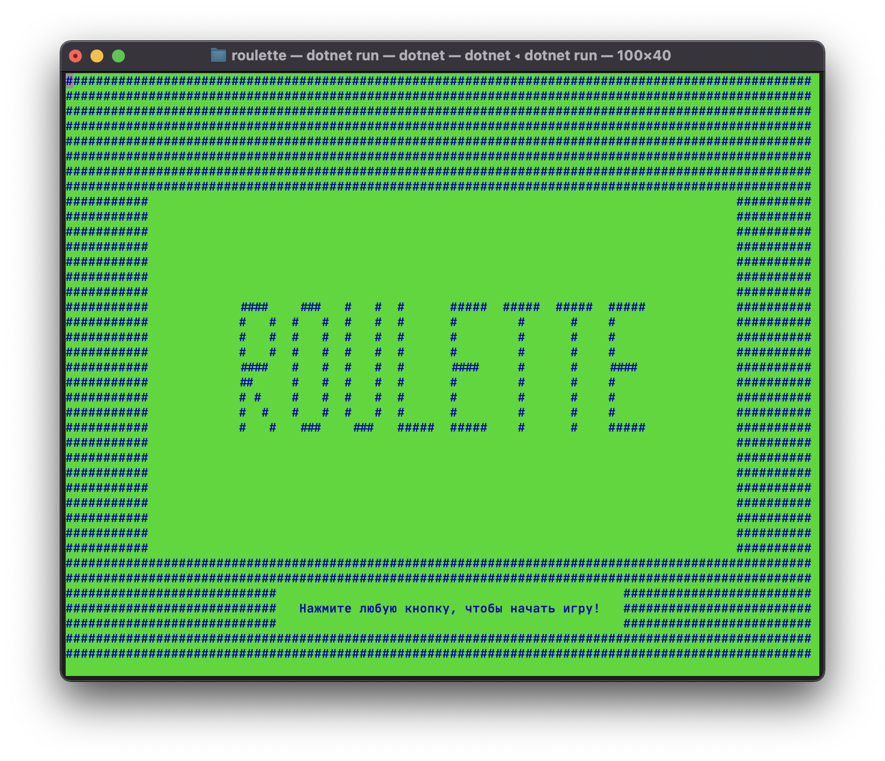
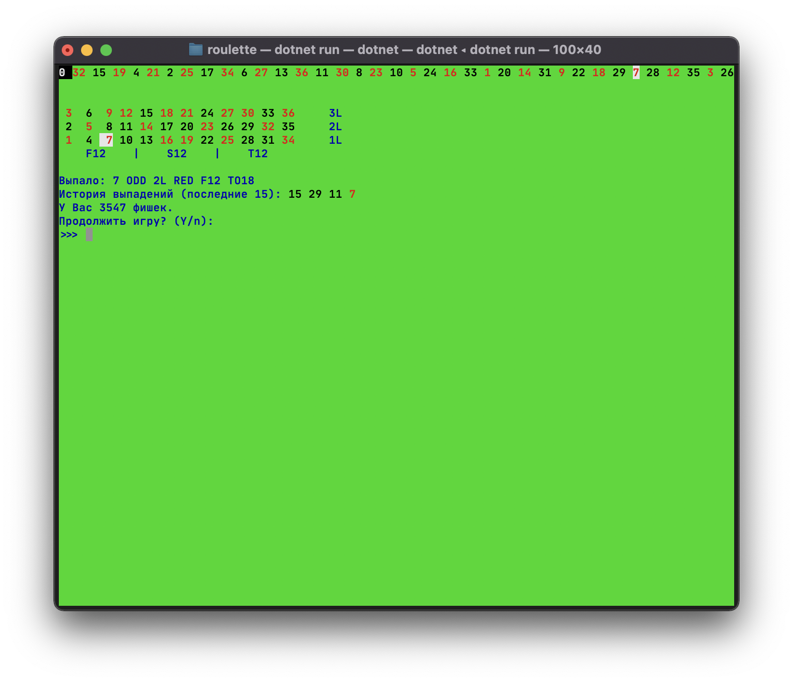

# Рулетка / Roulette

## Игра с открытым исходным кодом на VB.NET / Open source game on VB.net

Создатель и сопроводитель: Иван Бущик <ivan@bushchik.ru> / Creator and maintainer: Ivan Bushchik <ivan@bushchik.ru>

Лицензия: MIT / License: MIT

Игра представляет собой Европейскую рулетку в консоли. / Game is european roulette in terminal.

## Поддержка
|Платформа / Platform|Статус / Status|
|---|:---:|
|linux-x64|✅|
|linux-arm64|✅|
|macOS-x64 (Intel)|✅|
|macOS-arm64 (Rosetta)|✅|
|Windows-x64| ❌ |
|Windows-arm64| ❌ |
## Запуск

1. Скачать нужный файл со страницы Releases / Download executable from "Releases" page
2. Запустить / Run
3. Проверить размер окна (рекомендуется 100х40 символов) / Check window size (recommended is 100x40)
4. Profit

## Скриншоты / Screenshots

## Перевод / translation

English localisation done
